# Description

### Control:
- Arrows - move player
- Space - set bomb
- P - pause
- F - fullscreen
- Alt - remote bomb explosion

### Rounds:

1. [The Wall](#round-1)
2. Rocky Mountains
3. River
4. Forest
5. Lava Cave
6. Inside of the Castle, Part I
7. Inside of the Castle, Part II
8. Inside of the Castle, Final Stage

### Enemies:
- [Ballom](#ballom)
- [Ekutopu](#ekutopu)
- [Pomori](#pomori)
- [Boyon](#boyon)
- [Telpio](#telpio)
- [Pass](#pass)
- [Pontan](#pontan)
- [Arion](#arion)

### Bonuses:
- [Fire](#fire-up)
- [Bomb](#bomb-up)
- [Speed](#speed-up)
- [Remote Control](#remote)
- [Bomb Pass](#bomb-pass)
- [Life](#life)
- [Wall Pass](#wall-pass)

# Rounds:

### Round 1: The Wall 
- Stage 1:
  - Enemies:
    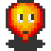
    
    
  - Bonus: fire

- Stage 2:
  - Enemies:
    
    
    
    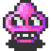
  - Bonus: bomb

- Stage 3:
  - Enemies:
    
    
    
    
  - Bonus: speed

- Stage 4:
  - Enemies:
    
    
    
    
    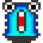
  - Bonus: remote control

- Stage 5:
  - Enemies:
    
    
    
    
    
    
  - Bonus: bomb pass

- Stage 6:
  - Enemies:
    
    
    
    
    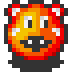
  - Bonus: life

- Stage 7:
  - Enemies:
    
    
    
    
    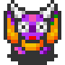
    
  - Bonus: wall pass

- Stage 8:
  - Enemies:
    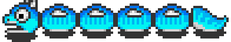
    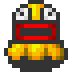
    
  - Bonus: no

# Enemies:

| Name    | Intellect | Wallpass | Bombpass | Speed | Score | Sprite                                    |
|---------|:---------:|:--------:|:--------:|:-----:|:-----:|:-----------------------------------------:|
| Ballom  | no        | no       | no       | low   | 100   |   |
| Ekutopu | no        | no       | no       | low   | 400   |  |
| Pomori  | no        | yes      | no       | low   | 800   |   |
| Boyon   | no        | no       | no       | low   | 1000  |    |
| Telpio  | no        | yes      | no       | low   | 2000  |   |
| Pass    | yes       | no       | no       | high  | 4000  |     |
| Pontan  | yes       | yes      | no       | high  | 8000  |   |
| Arion   | yes       | no       | yes      | low   | 20000 | 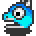   |

### Ballom: 
- Names: Valcom, Balloon.
- Behavior: in a collision with an obstacle changes his direction randomly.
- Sprite: 

### Ekutopu: 
- Behavior: sometimes changes his direction randomly.
- Sprite: 

### Pomori: 
- Names: Pat.
- Behavior: very often changes his direction randomly.
- Sprite: 

### Boyon: 
- Behavior: very often changes his direction randomly.
- Sprite: 

### Telpio: 
- Names: Terupyo.
- Behavior: very often changes his direction randomly.
- Sprite: 

### Pass: 
- Names: Tiger.
- Behavior: pursues the hero from close range.
- Sprite: 

### Pontan: 
- Names: Foton.
- Behavior: constantly pursues the hero.
- Sprite: 

### Arion: 
- Behavior: almost always pursues the hero.
- Sprite: 

# Bonuses:

### Fire: 
- Effect: increases the maximum explosion radius by one.
- Max quantity: 10.
- Sprite: 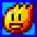

### Bomb: 
- Effect: increases the number of simultaneous bombs by one.
- Max quantity: 5.
- Sprite: 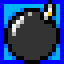

### Speed: 
- Effect: increases the player's speed by one.
- Max quantity: 2
- Sprite: 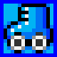

### Remote Control: 
- Effect: it allows the player to detonate bombs at any given time.
- Max quantity: 1.
- Sprite: 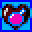

### Bomb Pass: 
- Effect: it allows the player to walks through bombs.
- Max quantity: 1.
- Sprite: 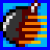

### Life: 
- Effect: it gives the player an additional life.
- Max quantity: 10
- Sprite: 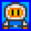

### Wall Pass: 
- Effect: it allows the player to walk freely through soft blocks.
- Max quantity: 1
- Sprite: 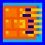