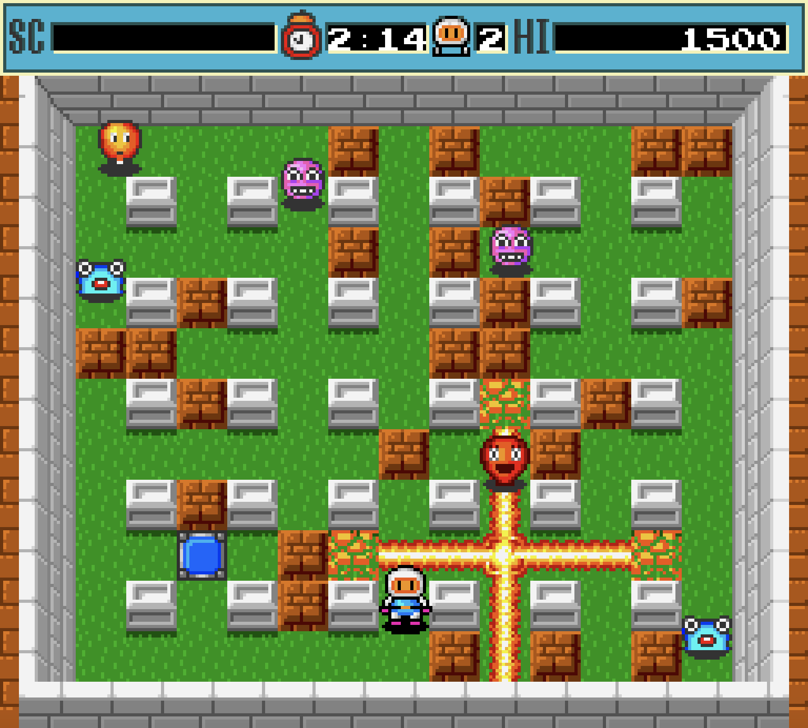

# Dyna Blaster [HTML5]

[Play the game!](https://nosferat.github.io/dyna-blaster/)

Dyna Blaster - is a clone of a classic game known as Bomberman.  
The game is written entirely in JavaScript ES6 without any libraries.

## Control
- Arrows - move player
- Space - set bomb
- P - pause

## Instalation
- Clone this repository
- Run any HTTP server
- Launch `index.html`

## Requirements
- The latest version of Google Chrome or Mozilla Firefox